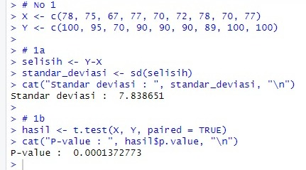
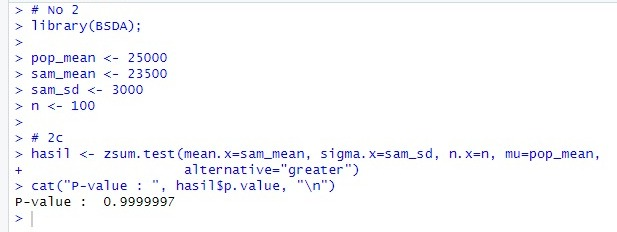
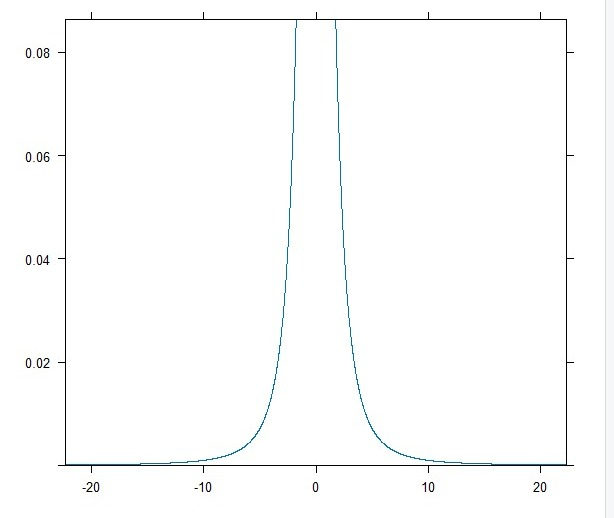
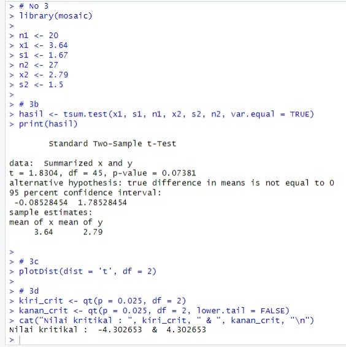
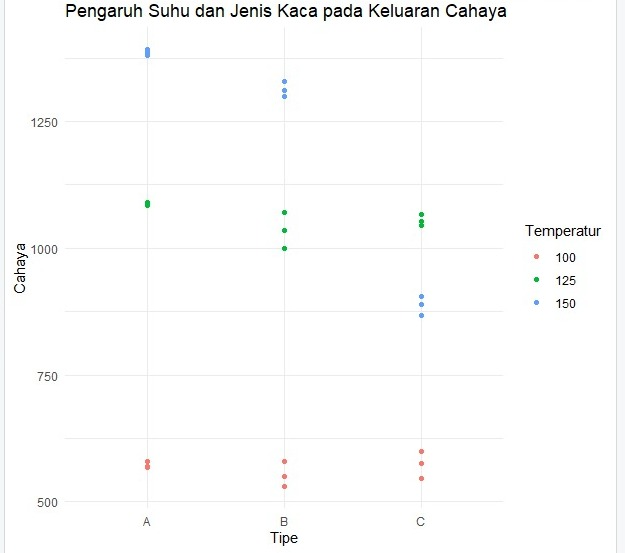
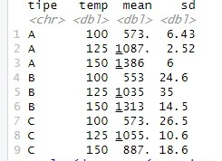

# Praktikum 2 Probstat
Nama : Richard Ryan  
NRP : 5025211141  
Kelas : C  

# No 1
Seorang peneliti ingin menguji kadar saturasi oksigen sebelum dan sesudah aktivitas. 9 Responden akan diukur kadar saturasi oksigennya terlebih dahulu (X), kemudian mereka akan diminta melakukan aktivitas A, setelah itu akan diukur kembali kadar saturasi oksigen mereka (Y)  
Berikut ini adalah data yang didapat

| Responden  |  X  |  Y  |
| ---------- | --- | --- |
|      1     | 78  | 100 |
|      2     | 75  |  95 |
|      3     | 67  |  70 |
|      4     | 77  |  90 |
|      5     | 70  |  90 |
|      6     | 72  |  90 |
|      7     | 78  |  89 |
|      8     | 70  | 100 |
|      9     | 77  | 100 |

## 1a
### Carilah Standar deviasi dari data selisih pasangan pengamatan tabel diatas
Pertama-tama, akan didapatkan terlebih dahulu selisih data dari setiap pengamatan  
Setelah itu, dapat digunakan fungsi sd() untuk mendapatkan nilai standar deviasi dari selisih tersebut  
Didapat bahwa standar deviasi selisih pasangan adalah **7.838651**

## 1b
### Carilah nilai t (p-value)
Dengan melakukan Uji T pada kedua sampel, dapat didapatkan nilai P nya  
Dapat digunakan t.test(X,Y,paired=TRUE) untuk melakukan uji T tersebut, dalam hal ini digunakan paired=TRUE sebab data X dan Y berpasangan  
Didapatkan bahwa nilai P nya adalah **0.0001372773**

## 1c
### Tentukanlah apakah terdapat pengaruh yang signifikan secara statistika dalam hal kadar saturasi oksigen , sebelum dan sesudah melakukan aktivitas 𝐴 jika diketahui tingkat signifikansi 𝛼 = 5% serta H0 : “tidak ada pengaruh yang signifikan secara statistika dalam hal kadar saturasi oksigen sebelum dan sesudah melakukan aktivitas 𝐴”.
Dari (1b), diketahui bahwa nilai P adalah 0.0001372773
Didapatkan bahwa P-value (0.000137) < 𝛼 (0.05), sehingga keputusan yang diambil adalah **Tolak H0**  
**Kesimpulan : Terdapat pengaruh yang signifikan secara statistika dalam hal kadar saturasi oksigen sebelum dan sesudah melakukan aktivitas A**

## Foto & Output

# No 2
Diketahui bahwa mobil dikemudikan rata-rata lebih dari 25.000 kilometer per tahun.  
Diambil 100 sampel yang menunjukkan data rata-rata 23.500 kilometer per tahun dan standar deviasi 3.000 kilometer  

## 2a
### Apakah Anda setuju dengan klaim tersebut? Jelaskan.
Setuju  
Dari sampel yang ada mayoritas data akan berada pada rentang 20.500 hingga 26.500 dan jumlah data yang bernilai < 20.500 atau < 26.500 sangatlah kecil  
Nilai 25000 termasuk didalam rentang mayoritas tersebut sehingga bukanlah tidak mungkin bahwa rata-rata populasi adalah 25.000 mengingat pula kemungkinan bahwa sampel yang diambil lebih bias ke data bernilai kecil

## 2c
### Buatlah kesimpulan berdasarkan p-value yang dihasilkan!
H0 : mean >= 25.000  
H1 : mean < 25.000  

Ambil signifikansi (𝛼) 5%  

Karena jumlah sampel besar (n > 30), maka akan digunakan uji Z  
Dapat digunakan zsum.test(mean.x = 23500, sigma.x = 3000, n.x = 100, mu = 25000, alternative = "greater") untuk mendapatkan uji Z nya, disini mu merupakan klaim mean di hipotesa dan digunakan "greater" sebab H0 bertanda >=  
Dari uji Z tersebut didapatkan nilai P sebesar **0.9999997**  

Didapatkan bahwa nilai P (0.999) > 𝛼 (0.05), sehingga keputusan yang diambil adalah **Terima H0**  

**Kesimpulan : Secara rata-rata, setiap tahunnya mobil akan dikemudikan lebih dari 25.000 km**

## Foto & Output

# No 3
Diketahui perusahaan memiliki seorang data analyst yang ingin memecahkan permasalahan pengambilan keputusan dalam perusahaan tersebut. Selanjutnya didapatkanlah data berikut dari perusahaan saham tersebut.
| Nama kota/atribut      | Bandung | Bali |
| -----------------------| --------| ---- |
|     Jumlah saham       |    20   |  27  |
|      Sampel mean       |   3.64  | 2.79 |
| Sampel standar deviasi |   1.67  | 1.5  |

Asumsikan nilai varian sama, apakah ada perbedaan pada rata-ratanya (α = 0.05)?

## 3a
### H0 dan H1
H0 : mean (Bandung) = mean (Bali)  
H1 : mean (Bandung) != mean (Bali)

## 3b
### Hitung sampel statistik
Karena jumlah sampel kecil (n < 30), maka akan digunakan uji T  
Dapat digunakan tsum.test(3.64, 1.67, 20, 2.79, 1.5, 27, var.equal=TRUE) untuk melakukan uji T tersebut  
Didapatkan bahwa nilai statistiknya adalah **1.8304** dan nilai P nya adalah **0.07381**

## 3c
### Lakukan uji statistik dengan df=2
Hal ini dapat dilakukan dengan menggambarkan grafiknya dengan fungsi plotDist(dist = 't', df = 2), dist merupakan penanda jenis distribusi yang akan digunakan (dalam kasus ini adalah distribusi T)  

## 3d
### Nilai kritikal
Untuk mendapatkan nilai kritikalnya, akan digunakan fungsi qt(p = 0.025, df = 2) untuk nilai kritikal kiri dan qt(p = 0.025, df = 2, lower.tail = FALSE) untuk nilai kritikal kanan  
Digunakan p = 0.025 sebab ini merupakan uji 2 arah sehingga kedua ujung memiliki nilai α/2 = 0.025  
Didapatkan bahwa nilai kritikalnya adalah **-4.302653** dan **4.302653**

## 3e
### Keputusan
Nilai t (1.8304) berada diantara nilai kritikal (area terima H0)  
Nilai P (0.07381) > α (0.05)  
Maka keputusan yang diambil adalah **Gagal tolak H0**

## 3f
### Kesimpulan
Karena keputusan yang diambil adalah gagal tolak H0, maka kesimpulan yang diambil adalah **Tidak terdapat perbedaan rata-rata stok di Bandung dengan stok di Bali**

## Foto & Output

# No 4
Data yang digunakan merupakan hasil eksperimen yang dilakukan untuk mengetahui pengaruh suhu operasi (100˚C, 125˚C dan 150˚C) dan tiga jenis kaca pelat muka (A, B dan C) pada keluaran cahaya tabung osiloskop. Percobaan dilakukan sebanyak 27 kali dan didapat data sebagai berikut:
| Glass |	Temp | Light |
| ----- | ---- | ----- |
|   A   |	 100 |	580  |
|   A  	|  100 |  568  |
|   A   |	 100 |	570  |
|   B   |	 100 |  550  |
|   B   |	 100 |	530  |
|   B	  |  100 |  579  |
|   C   |	 100 |	546  |
|   C   |  100 |	575  |
|   C   |	 100 |	599  |
|   A   |	 125 | 1090  |
|   A	  |  125 | 1087  |
|   A	  |  125 | 1085  |
|   B   |	 125 | 1070  |
|   B   |	 125 | 1035  |
|   B	  |  125 | 1000  |
|   C   |  125 | 1045  |
|   C	  |  125 | 1053  |
|   C   |	 125 | 1066  |
|   A   |	 150 | 1392  |
|   A	  |  150 | 1380  |
|   A   |  150 | 1386  |
|   B   |  150 | 1328  |
|   B   |  150 | 1312  |
|   B	  |  150 | 1299  |
|   C   |  150 |  867  |
|   C   |	 150 |  904  |
|   C   |  150 |  889  |

## 4a
### Buatlah plot sederhana untuk visualisasi data.

## 4b
### Lakukan uji ANOVA dua arah.
Dapat digunakan fungsi aov(cahaya ~ tipe + temp + tipe:temp, data = data) untuk melakukan uji ANOVA.  
Cahaya ~ tipe + temp + tipe:temp berarti akan menguji apakah terdapat perbedaan rata-rata untuk cahaya dari variabel tipe, temp dan interaksi mereka

## 4c
### Tampilkan tabel dengan mean dan standar deviasi keluaran cahaya untuk setiap perlakuan (kombinasi kaca pelat muka dan suhu operasi).

## Foto & Output

